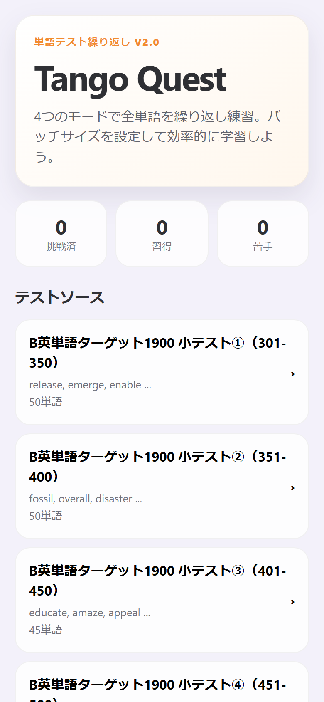
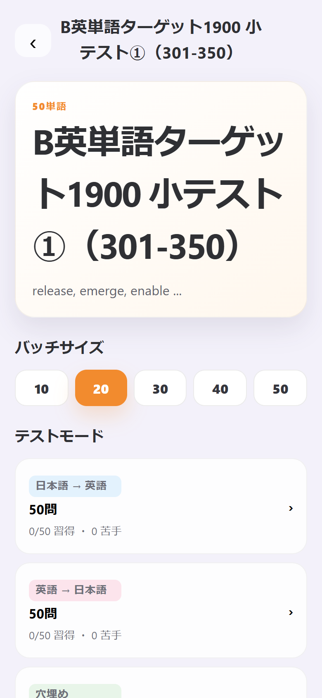
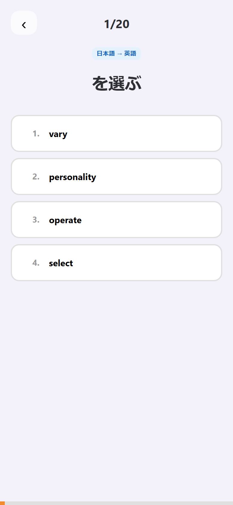
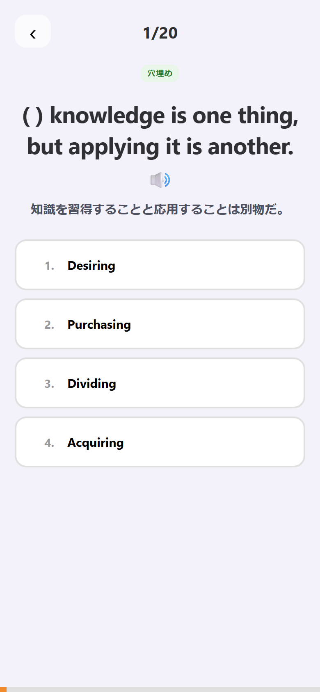
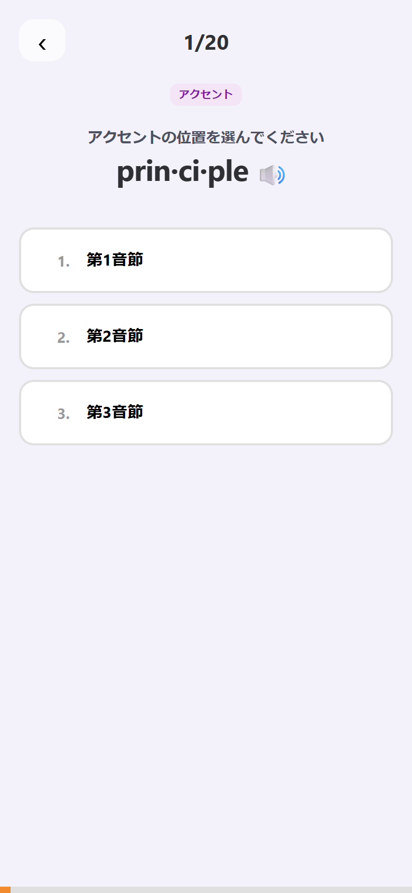
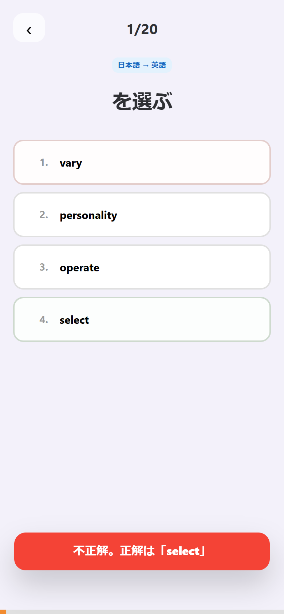

# Tango Quest 📚

英単語を 4 つのモードで繰り返しテストできる、スマホ向けの単語学習アプリです。
「英単語ターゲット1900」の小テスト範囲（301〜600）を収録しています。

React + Vite 製。学習履歴はブラウザの localStorage に保存されるため、サーバー不要で動作します。

## 画面と使い方

### ホーム画面



- 上部に学習状況のサマリー（**挑戦済 / 習得 / 苦手**）を表示します
- 「テストソース」から学習したい単語セット（各 45〜50 単語）を選択します
- 学習履歴はいつでもリセットできます

### ソース詳細画面



- **バッチサイズ**（10 / 20 / 30 / 40 / 50 問）を選んで、1 回あたりの出題数を調整できます
- **テストモード**は 4 種類。モードごとに「習得 / 苦手」の進捗が表示されます
- 画面下部の単語一覧では、単語ごとの正解・不正解の累計を確認できます

### クイズ画面（4 つのモード）

| 日本語 → 英語 | 穴埋め | アクセント |
| :---: | :---: | :---: |
|  |  |  |

| モード | 内容 |
| --- | --- |
| **日本語 → 英語** | 日本語の意味に合う英単語を 4 択から選ぶ |
| **英語 → 日本語** | 英単語の意味を日本語 4 択から選ぶ |
| **穴埋め** | 例文の空所に入る単語を選ぶ（日本語訳・読み上げ付き） |
| **アクセント** | 単語のアクセント（強勢）の位置を音節から選ぶ |

🔊 ボタンで単語・例文を読み上げできます（Web Speech API 使用）。

### 回答フィードバック



- 回答すると正解・不正解が即座に色とトーストで表示されます
- バッチ終了後は結果画面でスコアと間違えた問題を振り返り、残りの問題へ続けて挑戦できます

## 特徴

- 📱 スマホ最適化 UI（ホーム画面追加用のアイコン付き）
- 🔁 バッチ単位で全問を繰り返し出題（未出題の問題から優先的に出題）
- 📊 単語 × モードごとの正誤履歴を localStorage に自動保存
- 🎯 「習得」（2 回以上正解かつ正解 > 不正解）と「苦手」（誤答あり）を自動判定
- 🔊 英語の読み上げ機能

## 開発

```bash
npm install
npm run dev      # 開発サーバー起動
npm run build    # 本番ビルド（dist/ に出力）
npm run preview  # ビルド結果のプレビュー
```

## 技術スタック

- [React](https://react.dev/)
- [Vite](https://vite.dev/)
- Web Speech API（読み上げ）
